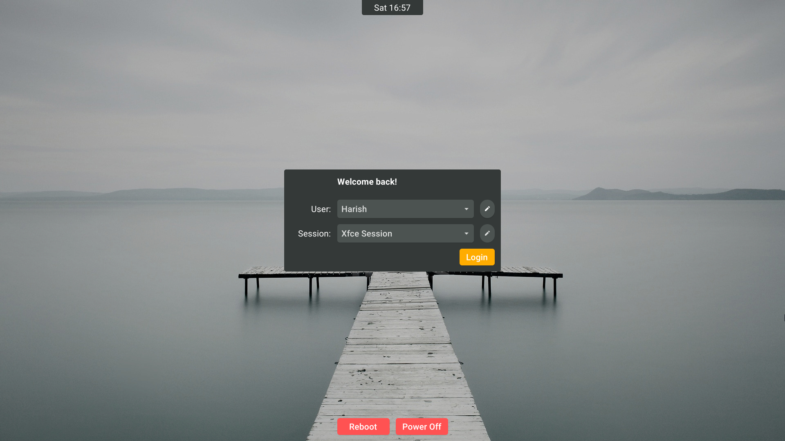

<!--
SPDX-FileCopyrightText: 2022 Harish Rajagopal <harish.rajagopals@gmail.com>

SPDX-License-Identifier: GPL-3.0-or-later
-->

<!--
SPDX-FileCopyrightText: 2021 Maximilian Moser <maximilian.moser@tuwien.ac.at>

SPDX-License-Identifier: MIT
-->

# egreet

A clean and customizable GTK-based [greetd](https://git.sr.ht/~kennylevinsen/greetd) greeter written in Rust using [Relm4](https://relm4.org/).
This is meant to be run under a Wayland compositor (like [Sway](https://github.com/swaywm/sway)).

It is based on [Max Moser's LightDM Elephant greeter](https://github.com/max-moser/lightdm-elephant-greeter), which is based on [Matt ~~Shultz's~~ Fischer's example LightDM greeter](https://web.archive.org/web/20210923235052/https://www.mattfischer.com/blog/archives/5).

## Screenshot


This uses the [Canta GTK theme](https://github.com/vinceliuice/Canta-theme) in dark mode with the Roboto font.

## Features
* Shows a dropdown list of existing users and X11/Wayland sessions
* Allows manual entry of username and session command
* Remembers the last authenticated user
* Automatically selects the last used session per user
* Supports customizing:
    - Background image
    - GTK theme
    - Dark mode
    - Cursor theme
    - Font

## Requirements
* Rust 1.57.0+ (for compilation only)
* greetd
* GTK 4.0+
* A Wayland compositor (such as [Cage](https://www.hjdskes.nl/projects/cage/) or [Sway](https://swaywm.org/))

**Note**: Please make sure you have all requirements installed, as having a greetd greeter constantly failing isn't as much fun as it sounds.

## Installation
First, the greeter must be compiled using Cargo:
```sh
cargo build --release
```

The compilation process also configures the greeter to look for or use certain directories.
These can be changed by setting the values of certain environment variables.
These are:

Environment Variable | Default | Use
-- | -- | --
GREETD\_CONFIG\_DIR | `/etc/greetd` | The configuration directory used by greetd
CACHE\_DIR | `/var/cache/egreet` | The directory used to store cache
LOG\_DIR | `/var/log/egreet` | The directory used to store logs
SESSION\_DIR | `/usr/share/xsessions:/usr/share/wayland-sessions` | A colon (:) separated list of directories where the greeter looks for session files

The greeter can be installed by copying the file `target/release/egreet` to `/usr/bin` (or similar directories like `/bin`).

## Usage
## Set as Default Session
Edit the greetd config file (`/etc/greetd/config.toml`) to set egreet with a Wayland compositor as the default session.
For example, if using Cage:
```toml
[default_session]
command = "cage -s -- egreet"
user = "greeter"
```
The -s argument enables VT switching in cage (0.1.2 and newer only), which is highly recommended to prevent locking yourself out.

If using Sway, create a sway config file (in a path such as `/etc/greetd/sway-config`) as follows:
```
exec "egreet; swaymsg exit"
include /etc/sway/config.d/*
```

Then, set Sway to use this config (whose path is shown here as `/path/to/custom/sway/config`) as the default greetd session:
```toml
[default_session]
command = "sway --config /path/to/custom/sway/config"
user = "greeter"
```

Restart greetd to use the new config.

### Generated Files
The cache is are stored in `/var/cache/egreet/cache.toml`.
It contains the last authenticated user and the last used session per user.

The log file is stored in `/var/log/egreet/log`.
Once the log file reaches a limit, it is compressed and rotated to `/var/log/egreet/log.X.gz`, where `X` is the index of the log file.
The higher the index, the older the log file.
After reaching a limit, the oldest log file is removed.

## Configuration
The configuration file must be named `egreet.toml`, and in the [TOML](https://toml.io/) format.
It should be located in the greetd configuration directory specified during compilation (`/etc/greetd/` by default).
A sample configuration is provided along with sample values for all available options in [`egreet.sample.toml`](egreet.sample.toml).

## Licenses
This repository uses [REUSE](https://reuse.software/) to document licenses.
Each file either has a header containing copyright and license information, or has an entry in the [DEP5 file](https://www.debian.org/doc/packaging-manuals/copyright-format/1.0/) at [.reuse/dep5](./.reuse/dep5).
The license files that are used in this project can be found in the [LICENSES](./LICENSES) directory.

A copy of the GPL-3.0-or-later license is placed in [LICENSE](./LICENSE), to signify that it constitutes the majority of the codebase, and for compatibility with GitHub.
